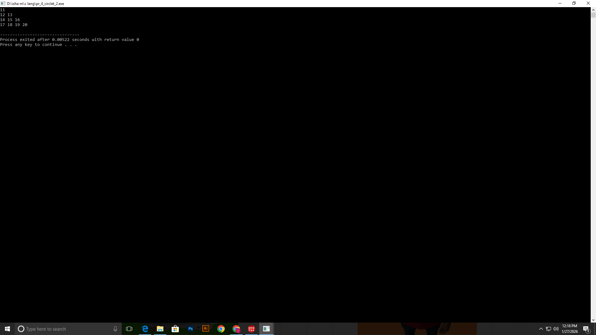
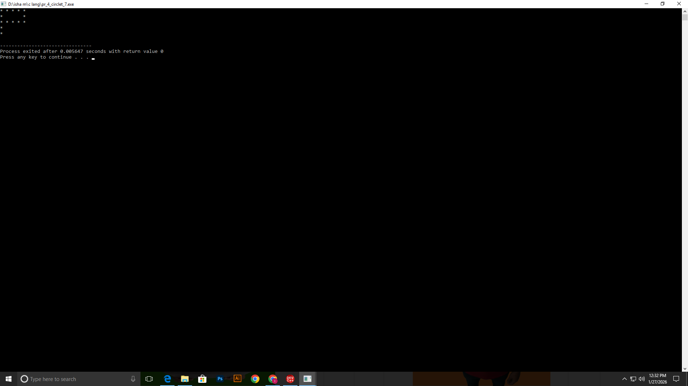
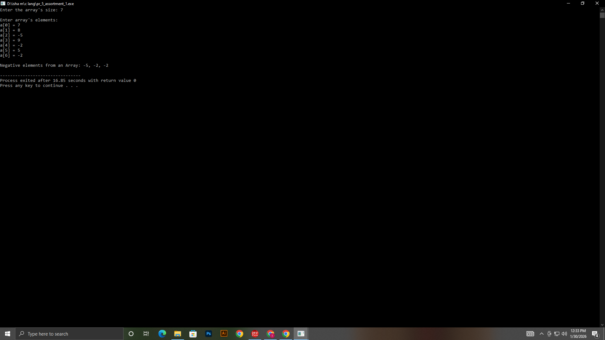
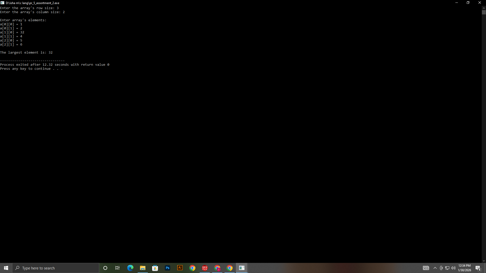
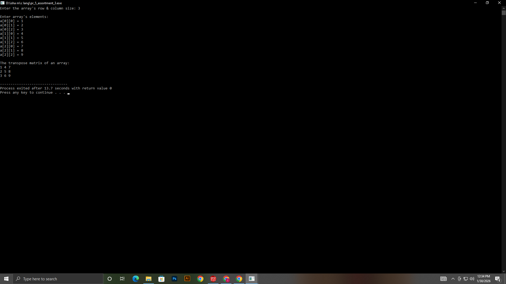
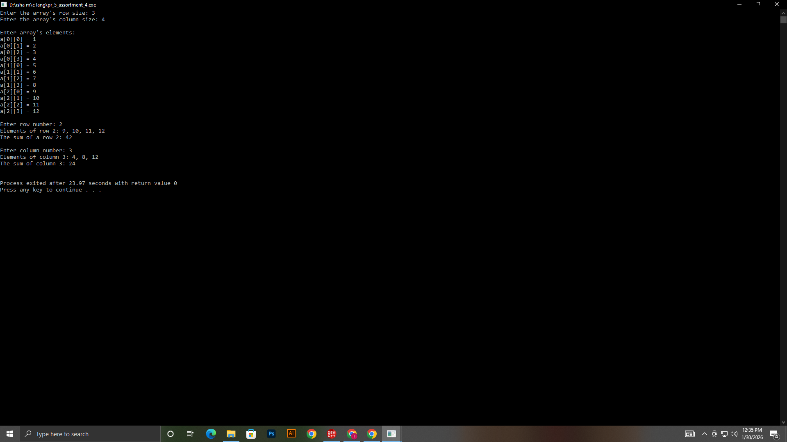

# Project: PR. 4 Circlet

## Task Outputs

### pr-4 q-1

### pr-4 q-2

### pr-4 q-3

### pr-4 q-4

### pr-4 q-5

### pr-4 q-6

### pr-4 q-7

# Project: PR. 5 Assortment
## Task Outputs

### pr-5 q-1

### pr-5 q-2

### pr-5 q-3

### pr-5 q-4

# Project: PR. 6 Filament
### pr-6 q-1,2

